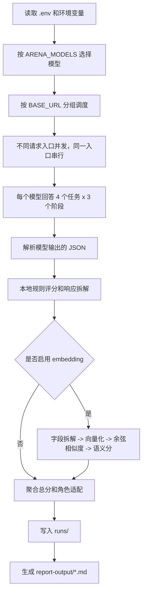
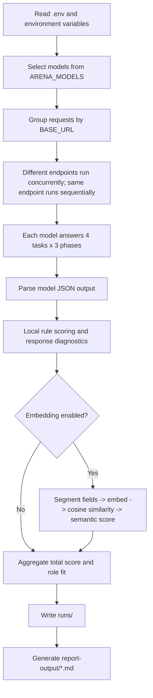

# MultiModelArena

MultiModelArena 是一个本地多模型评测工具。它读取 `.env` 里的模型配置，让多个模型回答同一组结构化决策题，再生成一份 Markdown 报告，说明每个模型的分数、失败项、行为特征和适合承担的会议角色。

当前主流程评估的是“模型 + 参数 + 调用方式”的组合，不是模型的绝对人格。评分不使用模型裁判；默认使用本地规则，开启 embedding 后会额外使用参考答案语义相似度。

## 快速开始

复制 `.env.example` 为 `.env`，在 `ARENA_MODELS` 写入要评测的 alias，并为这些 alias 填好 `PROVIDER`、`BASE_URL`、`API_KEY`、`MODEL_NAME`。

- 运行正式评测：`python -m arena assessment-run`
- 根据最近一次运行重新生成报告：`python -m arena assessment-report --input runs/latest`

报告会生成到 `report-output/`。原始记录会保存到 `runs/<run_id>/`，最近一次运行会复制到 `runs/latest`。

## CLI 命令速查

- 正式评测主流程，会调用 `ARENA_MODELS` 中启用的模型并生成报告：`python -m arena assessment-run`
- 从最近一次运行重新生成报告，不重新调用模型：`python -m arena assessment-report --input runs/latest`
- 只检查配置，不发起模型请求：`python -m arena assessment-run --dry-run`
- 使用 fake provider 离线跑通主流程，不需要真实 API Key：`python -m arena assessment-run --provider fake`
- 离线跑通聊天模型和 embedding 语义评分全流程：`python -m arena assessment-run --provider fake --embedding-provider fake`
- 对当前启用的所有模型各调用一次，检查连通性：`python -m arena probe-model`
- 只探测一个模型 alias：`python -m arena probe-model --alias minimax_t01`
- 用自定义自然语言提示词测试连通性：`python -m arena probe-model --alias minimax_t01 --prompt "你是什么模型"`
- 排查时显示模型原始响应：`python -m arena probe-model --alias minimax_t01 --show-response`
- 运行旧版互评流程；保留可用，但不是当前主流程：`python -m arena run --provider fake`

## 主流程会发生什么



默认每个模型会请求 12 次：4 个领域，每个领域 1 个基准题和 2 个扰动题。不同 `BASE_URL` 会并发；同一个 `BASE_URL` 会排队串行，避免多个模型同时打到同一个供应商网关。

## 报告怎么看

报告不是“谁绝对最聪明”的排行榜，而是“在当前任务、提示词、参数和调用方式下，哪个模型更适合什么角色”。

- **总评分**：多个评分组的平均值，满分 10。
- **失败项**：包括调用失败、JSON 解析失败。解析失败的轮次会在核心评分项中按 0 计入。
- **领域评分**：个人生活、事业与成长、人际与关系、资源与风险四类任务的表现。
- **过程质量**：问题框架、价值识别、备选方案、信息利用、推理、执行承诺。
- **响应拆解**：约束锚定、价值拆解、权衡推理、信息追问、风险与可逆性、行动可执行性、变化适配、校准边界、方法多样性。
- **参考答案语义相似度**：启用 embedding 后出现，表示回答字段与本地参考答案字段的语义接近程度。
- **推荐角色**：给下游“民主集中制会议”分配模型角色使用，不是模型品牌标签。

## 评估体系核心思想

当前没有模型裁判，也没有 judge model。模型回答之后，程序只做本地计算；启用 embedding 时，也只是调用向量化模型把文本变成向量，不让另一个聊天模型打分。

当前评分也不是纯关键词匹配：

- `alternatives` 数量来自 JSON 数组长度，不是看文本里有没有 `1、2、3`。
- JSON 完整性、行动计划、风险数量、优缺点数量、排序数量、可逆性、置信度都来自结构字段和计数。
- 关键词只用于少数弱信号：坏方案规避、可接受方案匹配、扰动响应、方法指纹。
- embedding 语义分只负责“和参考答案思路是否接近”，不替代格式、边界、扰动和行动计划规则。

总分的思想是：

```text
总分 = 本地硬规则 + 过程质量 + 响应拆解 + 可选参考答案语义相似度 + 角色适配
```

## 向量化和余弦相似度

embedding 会把一句话变成一串数字。例如：

```text
"优先选择低强度海边城市"
→ [0.12, -0.03, 0.88, 0.41, ...]
```

如果模型是 768 维，就会返回 768 个数字。这 768 个数字可以理解为 768 维空间里的一个箭头。人类画不出来 768 维空间，但数学公式仍然成立。

`dimensions` 表示要返回多少维向量：

- `ARENA_EMBEDDING_DIMENSIONS=None`：请求里不传维度，使用模型默认值。
- `ARENA_EMBEDDING_DIMENSIONS=512`：请求里传 `dimensions=512`，要求服务返回 512 个数字。

当前缓存保存的是所有向量化过的文本片段，不只是参考答案。包括参考答案字段、模型回答字段，以及以后重复出现的相同文本。缓存键包含 provider、base_url、embedding 模型、维度、返回格式和文本 hash。

余弦相似度计算的是两个向量方向是否接近：

```text
cosine_similarity = A·B / (|A| * |B|)
A·B = A1*B1 + A2*B2 + ... + A768*B768
```

二维情况下，这个公式可以从余弦定理推出来。设：

```text
A = (x1, y1)
B = (x2, y2)
```

两个向量的差是：

```text
A - B = (x1 - x2, y1 - y2)
```

所以：

```text
|A - B|² = (x1 - x2)² + (y1 - y2)²
         = x1² + y1² + x2² + y2² - 2(x1*x2 + y1*y2)
```

而：

```text
|A|² = x1² + y1²
|B|² = x2² + y2²
```

根据余弦定理：

```text
|A - B|² = |A|² + |B|² - 2|A||B|cos(θ)
```

把两种 `|A - B|²` 写法对比，会得到：

```text
x1*x2 + y1*y2 = |A||B|cos(θ)
```

左边就是点积 `A·B`，所以：

```text
A·B = |A||B|cos(θ)
cos(θ) = A·B / (|A| * |B|)
```

这就是为什么这个算法叫“余弦相似度”。768 维只是把二维里的 `x1*x2 + y1*y2` 扩展成 768 项相乘再相加。

文字不同不会导致维度不一致。维度不一致通常是因为用了不同 embedding 模型，或者一次传了 `dimensions=512`、另一次使用默认 768 维。维度不同的向量不能比较。

余弦相似度会被映射成 0-10 分。默认：

```text
floor = 0.55
ceiling = 0.85
score = (similarity - floor) / (ceiling - floor) * 10
```

- 相似度 `<= 0.55` 记 0 分。
- 相似度 `0.70` 约等于 5 分。
- 相似度 `>= 0.85` 记 10 分。

## Embedding 配置

`.env.example` 默认使用硅基流动的 `netease-youdao/bce-embedding-base_v1`，默认关闭。填入 key 并打开开关后，主流程会加入语义评分。

```text
ARENA_EMBEDDING_ENABLED=false
ARENA_EMBEDDING_PROVIDER=openai_compatible
ARENA_EMBEDDING_BASE_URL=https://api.siliconflow.cn/v1
ARENA_EMBEDDING_API_KEY=
ARENA_EMBEDDING_MODEL=netease-youdao/bce-embedding-base_v1
ARENA_EMBEDDING_DIMENSIONS=None
ARENA_EMBEDDING_ENCODING_FORMAT=float
ARENA_EMBEDDING_BATCH_SIZE=16
ARENA_EMBEDDING_TIMEOUT_SECONDS=120
ARENA_EMBEDDING_RETRY_COUNT=1
ARENA_EMBEDDING_DISABLE_PROXY=false
ARENA_EMBEDDING_CACHE_PATH=runs/embedding-cache.sqlite3
ARENA_EMBEDDING_SIMILARITY_FLOOR=0.55
ARENA_EMBEDDING_SIMILARITY_CEILING=0.85
ARENA_EMBEDDING_ROLE_WEIGHT=0.35
```

SQLite 当前足够用于缓存向量，因为参考答案和回答片段数量不大。Chroma 更适合大量题库、Top-K 检索和复杂元数据过滤；当前代码没有接入 Chroma。

## 会议角色

| 角色 | 用途 |
|---|---|
| 通用主持专家 | 框定议题，维持讨论顺序。 |
| 用户价值专家 | 识别真实目标、偏好和价值冲突。 |
| 信息审查专家 | 区分事实、假设和未知信息。 |
| 方案生成专家 | 提出多样化备选方案。 |
| 权衡仲裁专家 | 比较收益、成本、机会成本和约束匹配度。 |
| 风险专家 | 识别风险、止损条件、可逆性和预案。 |
| 执行规划专家 | 把结论变成 7 天、30 天和复盘行动。 |
| 红队专家 | 挑战推荐方案，寻找反例和失败模式。 |
| 结论整合专家 | 整合多角色意见，形成最终建议和触发条件。 |

## 核心代码地图

- 任务定义：[src/arena/assessment/tasks.py](src/arena/assessment/tasks.py)
- 输出协议：[src/arena/assessment/protocol.py](src/arena/assessment/protocol.py)
- 主流程编排：[src/arena/assessment/evaluator.py](src/arena/assessment/evaluator.py)
- 本地规则评分：[src/arena/assessment/scoring.py](src/arena/assessment/scoring.py)
- 响应拆解：[src/arena/assessment/diagnostics.py](src/arena/assessment/diagnostics.py)
- 参考答案：[src/arena/assessment/reference_answers.py](src/arena/assessment/reference_answers.py)
- 语义评分：[src/arena/assessment/semantic_scoring.py](src/arena/assessment/semantic_scoring.py)
- 向量调用和缓存：[src/arena/embeddings.py](src/arena/embeddings.py)
- 报告生成：[src/arena/assessment/report.py](src/arena/assessment/report.py)
- 配置解析：[src/arena/config.py](src/arena/config.py)

## 输出文件

```text
runs/<run_id>/events.jsonl
runs/<run_id>/summary.json
runs/<run_id>/summary.sqlite3
runs/embedding-cache.sqlite3
report-output/model-arena-*.md
```

`.env`、API Key、本地运行记录和报告输出默认不应该提交到公开仓库。

---

## English Version

MultiModelArena is a local multi-model evaluation tool. It reads model configuration from `.env`, asks multiple models to answer the same structured decision tasks, and generates a Markdown report showing each model's score, failures, behavior profile, and suitable meeting roles.

The current main flow evaluates the combination of model, parameters, and calling method. It does not claim to measure a model's absolute personality. Scoring does not use a model judge. By default, it uses local rules; when embedding is enabled, it also uses reference-answer semantic similarity.

## Quick Start

Copy `.env.example` to `.env`, put the model aliases to evaluate in `ARENA_MODELS`, and fill in `PROVIDER`, `BASE_URL`, `API_KEY`, and `MODEL_NAME` for those aliases.

- Run the formal assessment: `python -m arena assessment-run`
- Regenerate the report from the latest run: `python -m arena assessment-report --input runs/latest`

Reports are written to `report-output/`. Raw records are saved under `runs/<run_id>/`, and the most recent run is copied to `runs/latest`.

## CLI Command Quick Reference

- Run the formal main assessment flow. It calls the models enabled in `ARENA_MODELS` and generates a report: `python -m arena assessment-run`
- Regenerate a report from the latest run without calling models again: `python -m arena assessment-report --input runs/latest`
- Validate configuration only, without sending model requests: `python -m arena assessment-run --dry-run`
- Run the main flow offline through the fake provider, without real API keys: `python -m arena assessment-run --provider fake`
- Run both chat and embedding semantic scoring fully offline: `python -m arena assessment-run --provider fake --embedding-provider fake`
- Call every enabled model once to check connectivity: `python -m arena probe-model`
- Probe only one model alias: `python -m arena probe-model --alias minimax_t01`
- Use a custom natural-language prompt for connectivity testing: `python -m arena probe-model --alias minimax_t01 --prompt "你是什么模型"`
- Show the raw model response for debugging: `python -m arena probe-model --alias minimax_t01 --show-response`
- Run the legacy peer-review flow. It remains available, but it is not the current main flow: `python -m arena run --provider fake`

## What The Main Flow Does



By default, each model receives 12 requests: 4 domains, each with 1 baseline task and 2 perturbation tasks. Different `BASE_URL` values run concurrently. Models sharing the same `BASE_URL` are queued sequentially to avoid hitting the same provider gateway in parallel.

## How To Read The Report

The report is not a ranking of who is absolutely smartest. It answers: under the current tasks, prompt, parameters, and calling method, which model is better suited for which role?

- **Total score**: the average of several score groups, out of 10.
- **Failures**: call failures and JSON parse failures. Parse-failed rounds count as 0 in core score items.
- **Domain scores**: performance on personal life, career and growth, relationships, and resources and risk.
- **Process quality**: problem framing, value detection, alternatives, information use, reasoning, and follow-through.
- **Response diagnostics**: constraint grounding, value decomposition, tradeoff reasoning, information seeking, risk and reversibility, execution specificity, adaptation to change, calibration boundary, and method diversity.
- **Reference-answer semantic similarity**: appears when embedding is enabled; it measures how semantically close response fields are to local reference-answer fields.
- **Recommended roles**: used for assigning models in a downstream democratic-centralism-style meeting. They are not brand labels.

## Core Evaluation Philosophy

There is no model judge and no judge model. After a model answers, the program only performs local computation. When embedding is enabled, it calls an embedding model to turn text into vectors, but it still does not ask another chat model to score the answer.

The current scoring is not pure keyword matching:

- The number of `alternatives` comes from the JSON array length, not from textual numbering like `1, 2, 3`.
- JSON completeness, action plans, risk counts, pros/cons counts, ranking counts, reversibility, and confidence all come from structured fields and counting.
- Keywords are only weak signals in a few places: bad-option avoidance, acceptable-option matching, perturbation response, and method fingerprints.
- The embedding semantic score only measures whether the answer is close to reference-answer reasoning. It does not replace format, boundary, perturbation, or action-plan rules.

The total score is conceptually:

```text
Total score = local hard rules + process quality + response diagnostics + optional reference-answer semantic similarity + role fit
```

## Embeddings And Cosine Similarity

An embedding turns a sentence into a list of numbers. For example:

```text
"Prioritize a low-intensity seaside city"
→ [0.12, -0.03, 0.88, 0.41, ...]
```

If the model returns 768 dimensions, the output contains 768 numbers. These numbers can be understood as an arrow in a 768-dimensional space. Humans cannot draw that space, but the math still works.

`dimensions` means how many numbers the vector should contain:

- `ARENA_EMBEDDING_DIMENSIONS=None`: do not send a dimensions parameter; use the model default.
- `ARENA_EMBEDDING_DIMENSIONS=512`: send `dimensions=512`; ask the service to return 512 numbers.

The current cache stores every text segment that has been embedded, not just reference answers. That includes reference-answer fields, model-response fields, and any identical text that appears again later. The cache key includes provider, base URL, embedding model, dimensions, return format, and text hash.

Cosine similarity measures whether two vector directions are close:

```text
cosine_similarity = A·B / (|A| * |B|)
A·B = A1*B1 + A2*B2 + ... + A768*B768
```

In two dimensions, this formula can be derived from the law of cosines. Let:

```text
A = (x1, y1)
B = (x2, y2)
```

The difference between the vectors is:

```text
A - B = (x1 - x2, y1 - y2)
```

So:

```text
|A - B|² = (x1 - x2)² + (y1 - y2)²
         = x1² + y1² + x2² + y2² - 2(x1*x2 + y1*y2)
```

And:

```text
|A|² = x1² + y1²
|B|² = x2² + y2²
```

By the law of cosines:

```text
|A - B|² = |A|² + |B|² - 2|A||B|cos(θ)
```

Comparing the two forms of `|A - B|²` gives:

```text
x1*x2 + y1*y2 = |A||B|cos(θ)
```

The left side is the dot product `A·B`, so:

```text
A·B = |A||B|cos(θ)
cos(θ) = A·B / (|A| * |B|)
```

This is why the algorithm is called cosine similarity. A 768-dimensional vector simply extends the two-dimensional `x1*x2 + y1*y2` into 768 multiply-and-add terms.

Different text does not cause different dimensions. Dimension mismatch usually happens because different embedding models were used, or one call used `dimensions=512` while another used the default 768 dimensions. Vectors with different dimensions cannot be compared.

Cosine similarity is mapped to a 0-10 score. Defaults:

```text
floor = 0.55
ceiling = 0.85
score = (similarity - floor) / (ceiling - floor) * 10
```

- Similarity `<= 0.55` becomes 0.
- Similarity `0.70` is about 5.
- Similarity `>= 0.85` becomes 10.

## Embedding Configuration

`.env.example` defaults to SiliconFlow `netease-youdao/bce-embedding-base_v1`, disabled by default. After adding an API key and enabling the switch, the main flow includes semantic scoring.

```text
ARENA_EMBEDDING_ENABLED=false
ARENA_EMBEDDING_PROVIDER=openai_compatible
ARENA_EMBEDDING_BASE_URL=https://api.siliconflow.cn/v1
ARENA_EMBEDDING_API_KEY=
ARENA_EMBEDDING_MODEL=netease-youdao/bce-embedding-base_v1
ARENA_EMBEDDING_DIMENSIONS=None
ARENA_EMBEDDING_ENCODING_FORMAT=float
ARENA_EMBEDDING_BATCH_SIZE=16
ARENA_EMBEDDING_TIMEOUT_SECONDS=120
ARENA_EMBEDDING_RETRY_COUNT=1
ARENA_EMBEDDING_DISABLE_PROXY=false
ARENA_EMBEDDING_CACHE_PATH=runs/embedding-cache.sqlite3
ARENA_EMBEDDING_SIMILARITY_FLOOR=0.55
ARENA_EMBEDDING_SIMILARITY_CEILING=0.85
ARENA_EMBEDDING_ROLE_WEIGHT=0.35
```

SQLite is enough for the current vector cache because the number of reference answers and response segments is small. Chroma is better for large benchmark sets, Top-K retrieval, and complex metadata filtering; it is not currently integrated.

## Meeting Roles

| Role | Purpose |
|---|---|
| General Facilitator | Frame the issue and maintain discussion order. |
| User Value Expert | Identify real goals, preferences, and value conflicts. |
| Information Review Expert | Separate facts, assumptions, and unknowns. |
| Option Generation Expert | Generate diverse alternatives. |
| Tradeoff Arbitration Expert | Compare benefits, costs, opportunity costs, and constraint fit. |
| Risk Expert | Identify risks, stop-loss conditions, reversibility, and contingency plans. |
| Execution Planning Expert | Turn conclusions into 7-day, 30-day, and review actions. |
| Red-Team Expert | Challenge recommendations and look for counterexamples and failure modes. |
| Conclusion Integration Expert | Integrate role opinions into final recommendations and trigger conditions. |

## Core Code Map

- Tasks: [src/arena/assessment/tasks.py](src/arena/assessment/tasks.py)
- Output protocol: [src/arena/assessment/protocol.py](src/arena/assessment/protocol.py)
- Main orchestration: [src/arena/assessment/evaluator.py](src/arena/assessment/evaluator.py)
- Local rule scoring: [src/arena/assessment/scoring.py](src/arena/assessment/scoring.py)
- Response diagnostics: [src/arena/assessment/diagnostics.py](src/arena/assessment/diagnostics.py)
- Reference answers: [src/arena/assessment/reference_answers.py](src/arena/assessment/reference_answers.py)
- Semantic scoring: [src/arena/assessment/semantic_scoring.py](src/arena/assessment/semantic_scoring.py)
- Embedding calls and cache: [src/arena/embeddings.py](src/arena/embeddings.py)
- Report generation: [src/arena/assessment/report.py](src/arena/assessment/report.py)
- Configuration parsing: [src/arena/config.py](src/arena/config.py)

## Output Files

```text
runs/<run_id>/events.jsonl
runs/<run_id>/summary.json
runs/<run_id>/summary.sqlite3
runs/embedding-cache.sqlite3
report-output/model-arena-*.md
```

`.env`, API keys, local run records, and report outputs should not be committed to a public repository by default.
